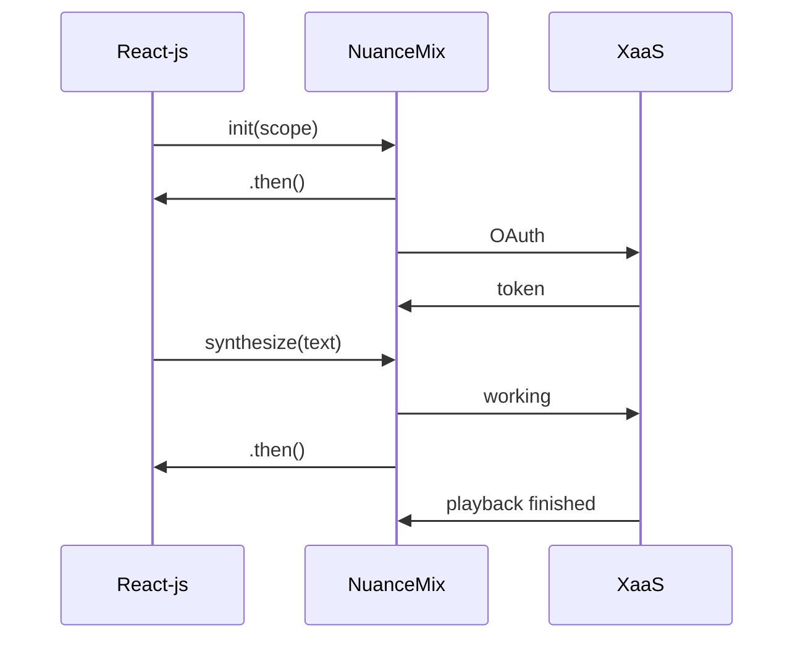

# react-native-nuance-mix 

A react-native node module plugin for Android and iOS providing access to Nuance Mix as a service. Head on over to [Mix](https://mix.nuance.com/v3/landing/) and signup for a free account there. You'll need to add your Mix credentials to your mobile app. You can see an [example](https://github.com/ms-cleblanc/NuanceMixReactNativeDemo) project with more details.


## Installation

You can create your own react-native application using a <i>stable</i> version of react-native `npx react-native init AwesomeProject --version 0.68.2`. For complete documentation on react-native see https://reactnative.dev/docs/getting-started. As of now this NuanceMix NPM is only available as a local plugin, it's on our radar to provide this software through the Node Package Manager NPM.

* (TODO) https://docs.npmjs.com/packages-and-modules/contributing-packages-to-the-registry

For adding local packages to your new react-native AwesomeProject edit package.json to add a line in dependencies like this.

```js
      "nuance-mix": "../react-native-nuance-mix"
```

---

### Android 

* modify app/build.gradle to add the dependency `implementation project(':nuance-mix')` 
* Define a valid SDK installation in the `local.properties` file in your AwesomeProject android folder
* run `yarn install`
* you should populate your AwesomeProject assets folder with your config.json file as well as any parameter files for the services you will use.
    * examples found in the sample/configs directory
* copy over the `src/main/jniLibs` directory from the node_module to AwesomeProject
* add the line to `AndroidManifest.xml` for recording audio permissions `<uses-permission android:name="android.permission.RECORD_AUDIO" />`
* ousr sample uses the `react-native-permissions` npm for requesting this permission https://github.com/zoontek/react-native-permissions

* test it out by running your Android AVD Manager with an android emulator and running `yarn android`

---

### iOS 

* you must first go to the react-native-nuance-mix/ios directory and run `pod install` 
* then you can run `yarn install` to pull in the node_modules
* finally you must go to your project ios directory and again run `pod install` to build the Pods
* you should add your config.json credentials as well as any parameter files you will use to your AwesomeProject Resources
    * examples found in the sample/configs directory
* Now you can run `yarn ios` and it will launch an emulator for your testing

---

Now you can begin to use the NuanceMix plugin in your javascript application by importing the components like this in your App.js

```js
import { NuanceMixInputText, NuanceMixText, NuanceMixChat } from 'nuance-mix';

const App: () => Node = () => {
  ...

    return (
    <View>
      <NuanceMixText
        style={styles.staticText}
        viewStyle={styles.staticContainer}
        voice="Paulina-Ml"
        language="es-MX"
        ssml="<speak>Aquí está Paulina hablando español.</speak>"
      >
        Here is Paulina speaking Spanish.
      </NuanceMixText>   
      <NuanceMixInput
            viewStyle={styles.inputContainer}
            style={styles.inputStyle}
            multiline={true}
            component={<Pressable 
                        style={styles.button}
                        title="listen"
                        >
                        <Text style={styles.buttontext}>Listen</Text>
                        </Pressable>
                    }
        />
        <NuanceMixChat />
    </View>
    );
  ...

```

## API

    The idea is to provide as simple an API as possible to the React-js layer pushing all of the complexity of audio handling, and gRPC into the NuanceMix layer. While this API is limited in functionality it will allow the React-js user to run Text to Speech (TTS), Automatic Speech Recognition (ASR), and Conversational AI dialog (DLG) services.

    The props for voice, model, language, and context should be supplied appropriately in the params.xxx.json files in your project and may also be overridden below using component properties.

### The NuanceMixText component

    The NuanceMixText component is simply a react-native <Text> that's wrapped in a react-native <View> component. 
    
* It currently only supports playback at 22050Hz. The voice, model and langauge props are optional, the default voice (Ava-Ml,english,enhanced).
    * If the voice is not specified we will use the voice parameters from params.tts.json in your project.
    * If you pass in an invalid combination of voice, language, model you will get the default voice, failing that you get the first voice in the list.

```js
            <NuanceMixText
                viewStyle // Any styling to be applied to the View component
                style // Any styling to be applied to the Text component itself
                // ...rest responds to all property types of Text and View and applied to both
                voice // String name of the voice to be used in this component, for Example (Allison, Ava-Ml, Chloe, Erica, Evan, Zoe-Ml) default is "Ava-Ml"
                language // String ex.: "en-us" or "es-mx", "fr-ca" ...  default is "en-us"
                model // "enhanced" or "standard" - must match with the available voices name and language default is "enhanced"
                ssml // Optional text to speak including optional ssml markup. Default component speaks the children that are displayed
            />
```

### The NuanceMixInput component

    The NuanceMixInput component is simply a react-native <TextInput> that's wrapped in a react-native <View> component with one additional required element. Users MUST pass some functional component for the user to click on to begin recognition 
    
  * *** If you pass in an invalid language you will get some error in the ADB log as there's no way to verify the language is supported ***

```js
            <NuanceMixInput
                viewStyle // Any styling to be applied to the View component
                style // Any styling to be applied to the Text component itself
                // ...rest responds to all property types of Text and View and applied to both
                initialText // Anything we should populate the initial TextInput container with
                component // Some react component, or collection of for the user to push to start recognition
                language // Language and region (locale) code as xx-XX, for example, en-US for American English.
                         // Codes in the form xxx-XXX (for example, eng-USA) are also supported for backward compatibility. 
                         // MUST be specified in the params.asr.json file and can be overridden here.
            />
```

### The NuanceMixChat component

        The NuanceMixChat component takes advatage of Nuance Mix Dialog to converse with the user driving the conversation. It consists of a <View> which contains a <FlatList> to contain the chat items

```js

            <NuanceMixChat 
                viewStyle // Any styling to be applied to the View component
                style // Any styling to be applied to the FlatList contentContainerStyle
                // ...rest responds to all property types of Text and View and applied to both
                FooterInput // This is an optional functional component, a default is provided
                FooterListener // This is optional, but required if using voice, no default provided
                FooterProgress // This is an optional listening animation, no default is provided
                LeftBubble // This is and optional text component for dialog responses, a default is provided
                RightBubble // This is an optional text component for dialog requests, a default is provided           
                contextTag // Context used to create the model urn, optional default is supplied in params.nlu.json
            />

            function CustomFooterInput({ value, onSubmitEditing, onChangeText }) {
                //...
                return (
                    // Some component or group containing a TextInput that's setting the following props
                    <TextInput
                        value={value}
                        onSubmitEditing={onSubmitEditing}
                        onChangeText={(text) => onChangeText}
                        //...other props
                    />
                );
            }

            function CustomFooterListener({ onPress }) {
                //...
                return (
                    // Some component or group containing any react-component the resonds to onPress and sets the value as a required prop
                );
            }

            function CustomFooterProgress({ isAnimating }) {
                //...
                return (
                    // Some progress component or group the responds to the property indeterminate where
                    indeterminate={isAnimating}
                );
            }

            function CustomLeftBubble({ key, text }) {
                //...
                return (
                    // Some component or group containing a Text where the property key is set and the child of text is used. Represents a dialog response.
                );
            }

            function CustomRightBubble({ key, text }) {
                //...
                return (
                    // Some component or group containing a Text where the property key is set and the child of text is used. Represents a dialog request.
                );
            }

```



## Contributing

See the [contributing guide](CONTRIBUTING.md) to learn how to contribute to the repository and the development workflow.

## License

MIT

---

Made with [create-react-native-library](https://github.com/callstack/react-native-builder-bob)
